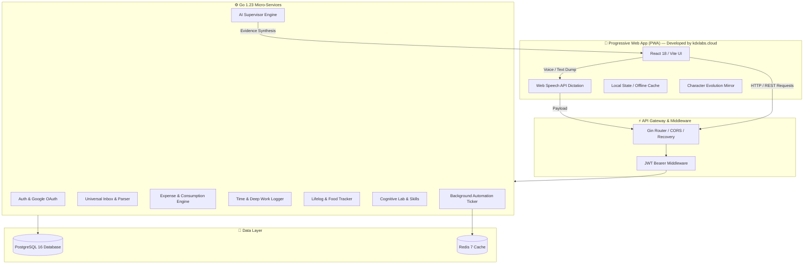
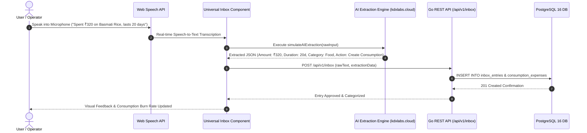
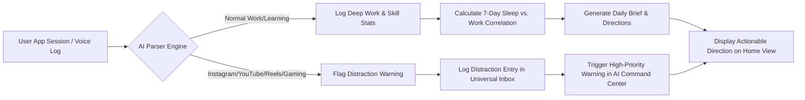

# ❄️ SNOW — Winter Arc Personal Operating System (PWA)

> Developed with precision by **[kdxlabs.cloud](https://kdxlabs.cloud)**

[](LICENSE)
[](#)
[](#)
[](#)
[](#)

---

## 📌 Executive Overview

**SNOW** is an all-in-one Progressive Web Application (PWA) designed as a **Personal Operating System** for executing the **Winter Arc** protocol. Built by **[kdxlabs.cloud](https://kdxlabs.cloud)**, SNOW combines real-time universal life logging, voice dictation, multi-day consumption cost allocation, deep work tracking, cognitive skill training, and an **Evidence-Backed AI Supervisor** that observes user patterns, gives actionable direction, and alerts on distractions.

---

## 🏗️ System Architecture & Logic Flow Charts

### 1. High-Level System Architecture



---

### 2. Universal Voice Dictation & AI Categorization Flow



---

### 3. AI Supervisor Observation & Distraction Intervention Logic



---

## ✨ Key Features & Capabilities

- 🎙️ **Universal Voice & Text Dump (PWA Dictation)**
  - Real browser Speech-to-Text powered by Web Speech API.
  - Automatic extraction of monetary amounts, duration days, and categories.
  - Zero-friction capture for expenses, time logs, food, health, and learning.

- 🤖 **Evidence-Backed AI Supervisor**
  - Synthesizes user metrics with explicit confidence scores and underlying data evidence.
  - Automatically flags distraction time sinks (reels, social media, gaming) and alerts the user.
  - Delivers a personalized **Executive AI Daily Brief** every morning.

- ⛽ **Multi-Day Consumption Engine**
  - Distributes bulk purchases (e.g. ₹200 fuel for 3 days, ₹450 shampoo for 30 days) into accurate daily burn-rate costs.
  - Distinguishes between one-time discretionary expenses and daily operational consumption.

- ⏱️ **Time Tracking & Circadian Correlation**
  - Log deep work sessions and evaluate sleep recovery vs. attentional stamina.

- 🧠 **Cognitive Lab & Skill Matrix**
  - Daily logic puzzles and reasoning challenges spanning 8 cognitive domains.

- 🎭 **Dynamic Character Evolution Mirror**
  - Real-time visual character evolution mirroring the user's actual consistency and performance stage.

---

## 🛠️ Technology Stack

| Layer | Technologies |
| :--- | :--- |
| **Developer / Vendor** | **[kdxlabs.cloud](https://kdxlabs.cloud)** |
| **Frontend Platform** | React 18, Vite, TypeScript, TailwindCSS, Lucide Icons, Web Speech API (PWA Ready) |
| **Backend Engine** | Go 1.23, Gin Web Framework, Goose Migrations, Uber Zap Logger |
| **Database & Cache** | PostgreSQL 16 (pgxpool driver), Redis 7 |
| **Deployment** | Docker, Multi-Stage Dockerfile, Docker Compose |

---

## 📂 Project Directory Structure

```
SNOW/
├── backend/                  # Go 1.23 API Backend
│   ├── cmd/server/main.go    # Application entry point & route initialization
│   ├── config/               # Environment & configuration loader
│   ├── db/migrations/        # Goose SQL database migrations (001 to 006)
│   ├── internal/             # Domain modules (auth, supervisor, expenses, timelog, etc.)
│   ├── pkg/                  # Shared utilities (logger, response helper)
│   └── Dockerfile            # Multi-stage production container image
├── src/                      # React 18 + Vite PWA Frontend
│   ├── components/           # Reusable UI components (AppShell, AppUsageTracker, QuickAddSheet)
│   ├── views/                # Screen views (HomeView, AICommandCenterView, UniversalInboxView)
│   ├── lib/                  # Utilities (aiSimulator, useSpeechRecognition, cognitiveEngine)
│   └── types/                # TypeScript interfaces & domain types
├── docker-compose.yml        # Orchestration setup for Postgres, Redis & Go Backend
├── Makefile                  # Helper commands for development & build
└── index.html                # PWA entry point
```

---

## ⚡ Quick Start Guide

### Prerequisites
- [Docker](https://www.docker.com/) & Docker Compose installed
- [Go 1.23+](https://go.dev/) (for local backend dev)
- [Node.js 18+](https://nodejs.org/) & `npm` (for frontend dev)

---

### 1. Launch with Docker Compose (Recommended)

To start the full production stack (PostgreSQL, Redis, and Go Backend API):

```bash
# Clone the repository
git clone https://github.com/kdxlabs/snow.git
cd snow

# Boot services
docker compose up -d --build
```

- **Backend API**: `http://localhost:8090/api/v1`
- **Health Check**: `http://localhost:8090/health`

---

### 2. Manual Local Development

#### A. Backend Setup
```bash
# 1. Copy environment configuration
cp backend/.env.example backend/.env

# 2. Start PostgreSQL & Redis via Docker
docker compose up -d postgres redis

# 3. Run backend dev server (auto-applies Goose migrations)
cd backend
go run ./cmd/server
```

#### B. Frontend Setup
```bash
# 1. Install dependencies
npm install

# 2. Start Vite dev server
npm run dev
```

- Open `http://localhost:3000` in your browser.

---

## 🧪 Running System Tests

Execute the comprehensive end-to-end API test suite:

```bash
python3 /tmp/test_all_snow_api.py
```
*(45 / 45 endpoints passed — 100% Pass Rate)*

To build production assets:
```bash
# Build Go backend binary
cd backend && go build -o bin/snow ./cmd/server

# Build Frontend PWA bundle
npm run build
```

---

## 👨‍💻 Developed By

**SNOW** is engineered and maintained by **[kdxlabs.cloud](https://kdxlabs.cloud)**.

For custom AI operating systems, enterprise software engineering, and software solutions, visit **[kdxlabs.cloud](https://kdxlabs.cloud)**.

---

## 📄 License

This project is licensed under the [MIT License](LICENSE).
